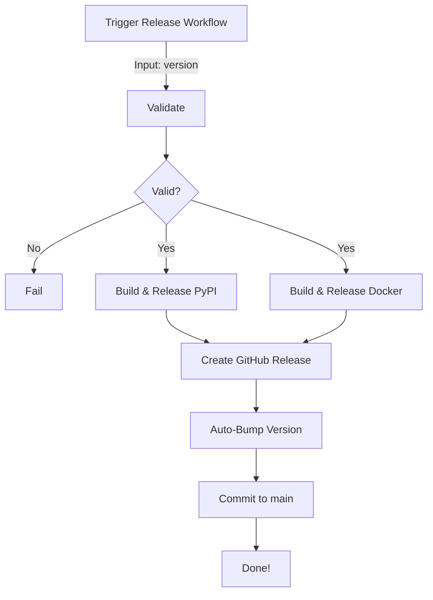

# Version Management Guide

## Overview

The `docbt` project uses **automated version bumping** integrated with the release workflow. After a successful release, the version is automatically incremented to prepare for the next development cycle.

## How It Works

### Release Workflow

1. **You trigger a release** with a version (e.g., `0.1.0`)
2. **Release jobs run** (PyPI, Docker, GitHub Release)
3. **Version auto-bump** happens after successful release
4. **Next development version** is committed to `main`

### What Gets Updated Automatically

- ✅ `pyproject.toml` - Version field
- ✅ `CHANGELOG.md` - Unreleased section prepared for next version

## Version Bumping Strategy

### Semantic Versioning

We follow [Semantic Versioning](https://semver.org/):

- **MAJOR** (`1.0.0` → `2.0.0`): Breaking changes
- **MINOR** (`0.1.0` → `0.2.0`): New features (backward compatible)
- **PATCH** (`0.1.0` → `0.1.1`): Bug fixes

### Auto-Bump Behavior

After releasing version `X.Y.Z`, the workflow automatically:

1. Sets version to `X.Y.Z` in all files
2. Creates tag `vX.Y.Z`
3. Bumps to `X.Y.(Z+1)` for next development
4. Commits with message: `chore: bump version to X.Y.(Z+1) [skip ci]`

**Example:**
```
Release 0.1.0 → Auto-bump to 0.1.1-dev
Release 0.2.0 → Auto-bump to 0.2.1-dev
```

## Usage Examples

### Example 1: Patch Release (Bug Fixes)

```bash
# Current version in main: 0.1.1 (from previous auto-bump)

# You want to release the bug fixes as 0.1.1
# Go to: Actions → Release → Run workflow
# Enter: 0.1.1
# ✅ Release 0.1.1 is created
# ✅ Auto-bumps to 0.1.2 in main
```

### Example 2: Minor Release (New Features)

```bash
# Current version in main: 0.1.2

# You want to release new features as 0.2.0
# Go to: Actions → Release → Run workflow
# Enter: 0.2.0
# ✅ Release 0.2.0 is created
# ✅ Auto-bumps to 0.2.1 in main
```

### Example 3: Major Release (Breaking Changes)

```bash
# Current version in main: 0.2.1

# You want to release breaking changes as 1.0.0
# Go to: Actions → Release → Run workflow
# Enter: 1.0.0
# ✅ Release 1.0.0 is created
# ✅ Auto-bumps to 1.0.1 in main
```

## Manual Version Bumping (Local Development)

If you need to manually bump versions locally:

```bash
# Install bump-my-version
pip install bump-my-version

# Bump patch version (0.1.0 → 0.1.1)
bump-my-version bump patch

# Bump minor version (0.1.1 → 0.2.0)
bump-my-version bump minor

# Bump major version (0.2.0 → 1.0.0)
bump-my-version bump major

# Set specific version
bump-my-version replace --new-version 2.0.0
```

### Via Makefile

```bash
# Show current version
make version

# Bump patch (via bump-my-version)
bump-my-version bump patch

# Bump minor
bump-my-version bump minor

# Bump major
bump-my-version bump major
```

## Configuration

Version bumping is configured in `pyproject.toml`:

```toml
[tool.bumpversion]
current_version = "0.1.0"
parse = "(?P<major>\\d+)\\.(?P<minor>\\d+)\\.(?P<patch>\\d+)"
serialize = ["{major}.{minor}.{patch}"]
search = "{current_version}"
replace = "{new_version}"
commit = true
message = "chore: bump version to {new_version} [skip ci]"
tag = false  # Tags are created by release workflow

[[tool.bumpversion.files]]
filename = "pyproject.toml"
search = 'version = "{current_version}"'
replace = 'version = "{new_version}"'

[[tool.bumpversion.files]]
filename = "CHANGELOG.md"
search = "## [Unreleased]"
replace = """## [Unreleased]

## [{new_version}] - {now:%Y-%m-%d}"""
```

## Release Workflow Details

The complete release process:



### Jobs Breakdown

1. **validate** - Ensures:
   - Running from `main` branch
   - Version format is valid (X.Y.Z)

2. **release-pypi** (if enabled):
   - Updates version in `pyproject.toml`
   - Builds package with `uv build`
   - Publishes to PyPI via Trusted Publishing

3. **release-docker** (if enabled):
   - Builds multi-platform images (amd64, arm64)
   - Pushes to registry (GHCR or Docker Hub)
   - Tags: `X.Y.Z`, `X.Y`, `X`, `latest`

4. **create-github-release**:
   - Creates git tag `vX.Y.Z`
   - Creates GitHub release with notes

5. **bump-version** (automatic):
   - Updates version to next patch
   - Commits with `[skip ci]` to avoid triggering CI
   - Pushes to `main`

## Best Practices

### 1. Keep CHANGELOG.md Updated

Before triggering a release, update `CHANGELOG.md`:

```markdown
## [Unreleased]

### Added
- New feature X

### Fixed
- Bug Y

### Changed
- Improved Z
```

The release workflow will keep this structure and the auto-bump will prepare a new `[Unreleased]` section.

### 2. Follow Semantic Versioning

Choose the version number based on changes:

- **Patch** (0.1.0 → 0.1.1): Bug fixes only
- **Minor** (0.1.1 → 0.2.0): New features, backward compatible
- **Major** (0.2.0 → 1.0.0): Breaking changes

### 3. Test Before Release

Always merge to `main` and verify CI passes before releasing:

```bash
# CI must pass before release
git checkout main
git pull
# Wait for CI checks to pass
# Then trigger release
```

### 4. Release Notes

The auto-generated release notes include:
- Version number
- Released components (PyPI/Docker)
- Installation instructions
- Link to CHANGELOG

You can edit the release notes on GitHub after creation.

## Troubleshooting

### Auto-Bump Failed

**Problem:** The bump-version job fails after release

**Solutions:**

1. Check branch protection rules don't block the bot
2. Ensure `GITHUB_TOKEN` has write permissions
3. Check for merge conflicts in `pyproject.toml` or `CHANGELOG.md`

### Wrong Version Auto-Bumped

**Problem:** It bumped to X.Y.Z+1 but you wanted a different increment

**Solution:** Manually adjust:

```bash
git checkout main
git pull

# Edit pyproject.toml to desired version
# Edit CHANGELOG.md

git add pyproject.toml CHANGELOG.md
git commit -m "chore: adjust version to X.Y.Z"
git push origin main
```

### CI Triggered After Auto-Bump

**Problem:** CI runs after the version bump commit

**Solution:** The commit message includes `[skip ci]` which should prevent this. If it still runs:

1. Check your CI trigger configuration
2. Add to `.github/workflows/ci.yml`:

```yaml
on:
  push:
    branches:
      - main
  # Skip CI on version bump commits
  pull_request:

jobs:
  skip-check:
    runs-on: ubuntu-latest
    if: "!contains(github.event.head_commit.message, '[skip ci]')"
```

## Advanced: Custom Bump Strategy

If you want to customize which version part gets bumped after release:

Edit `.github/workflows/release.yml` in the `bump-version` job:

```yaml
- name: Determine next version type
  id: version_type
  run: |
    # Example: Always bump minor after release
    echo "bump_type=minor" >> $GITHUB_OUTPUT

    # Or: Conditional based on released version
    CURRENT="${{ inputs.version }}"
    MINOR=$(echo $CURRENT | cut -d. -f2)

    if [ $MINOR -eq 9 ]; then
      echo "bump_type=major" >> $GITHUB_OUTPUT
    else
      echo "bump_type=minor" >> $GITHUB_OUTPUT
    fi
```

## Summary

✅ **Automated** - Version bumping happens automatically after each release  
✅ **Consistent** - Always follows semantic versioning  
✅ **Traceable** - All version changes are in git history  
✅ **Flexible** - Can be customized or done manually when needed  

For questions or issues, see:
- [Release Workflow](.github/workflows/release.yml)
- [Quick Reference](docs/CICD_QUICKREF.md)
